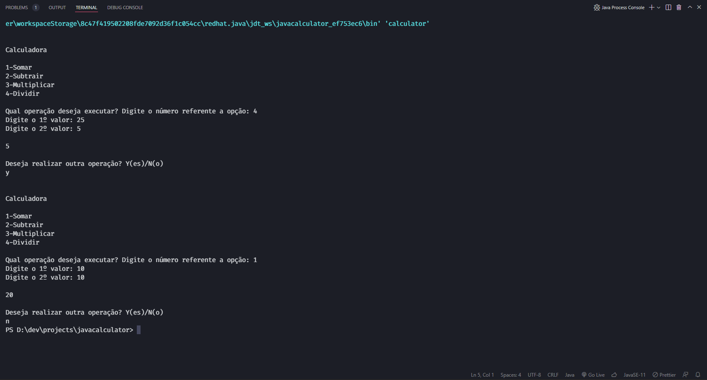

# Calculadora

➕ Uma calculadora que executa as quatro operações básicas.

Esse projeto foi desenvolvido para a disciplina de Arquitetura de Software utilizando a linguagem Java com o objetivo de revisar os conceitos de Programação Orientada a Objetos.

## Como funciona?

- Essa calculadora funciona via terminal.
- Para executar o projeto basta rodar a classe principal chamada ``calculator.java``.

## Exemplo de funcionamento

